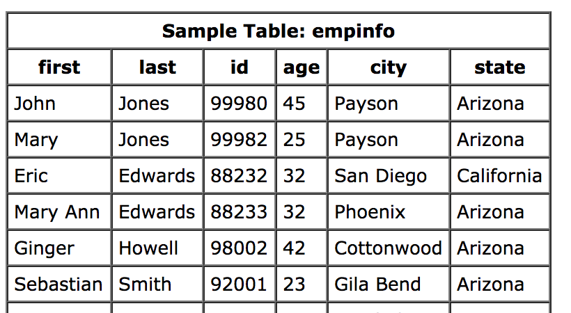
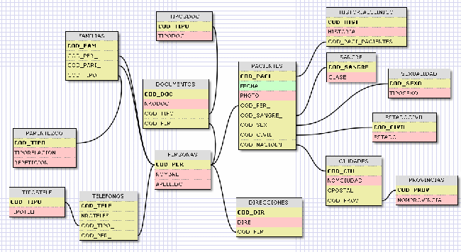
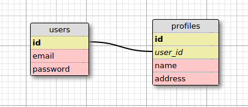
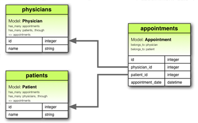
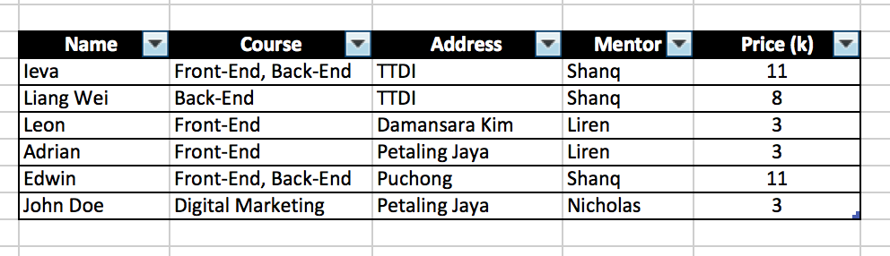
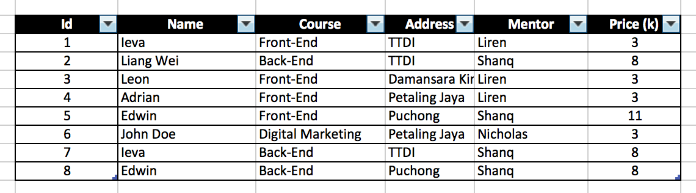
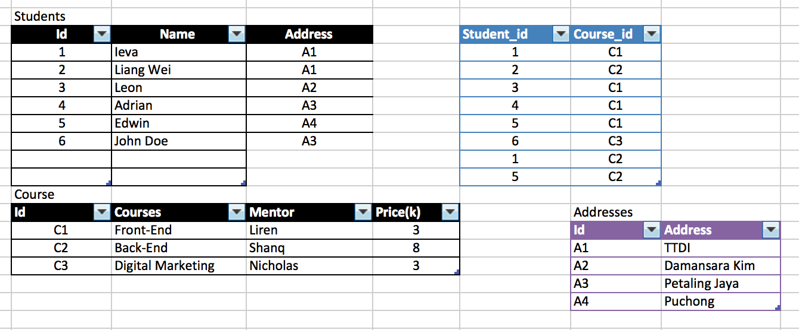
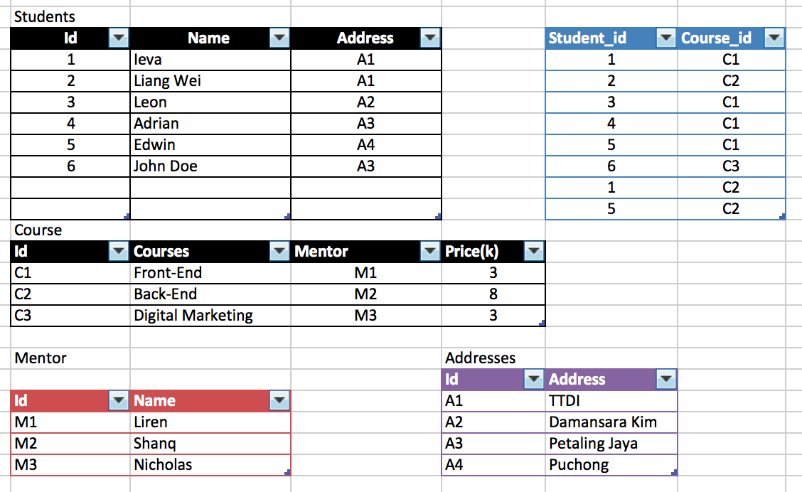

# Database & SQL

+++

### What is database

An Organized collection of data

**Analogy**

> It’s like your filing cabinet, not your junk drawer. The data is organized into folders, rather than just thrown in at random

+++

### Why we need database when developing Web App?

+++

### How databases look like??

yeap, they are just a bunch of tables

+++

### Okay.. in real life it's a little more complicated

+++

### SQL??? What?

* Structured Query Language
* Used to communicate with database

---
# Schema

+++
### One-to-One

> I'ts like my connection to my liver. I have a liver, and my liver belongs only to me

+++

### One-to-Many

> When you shop on Amazon, you can have many orders but each order belongs only to you.

+++

### Many-to-Many

> It's like walking into a library, you can borrow as many books as you like, but each of these book can also have many readers throughout its lifespan.
+++

### Important Components of a Database - 1 

Primary-key: a key and a unique identifier in a relational database that makes each record unique!

> It's like your genetic profile, it marks your unique identity and your existence

+++

### Important Components of a Database - 2 

Foreign-key: a foreign key is a field (or collection of fields) in one table that uniquely identifies a row of another table or the same table.

> It's like a wedding ring, you are a unique existence but that ring on your finger tells people that you belong to someone else.

---
# Database Normalization 

+++

### Basically...

* Eliminate redundancy
* Increase consistency
* Allow Easier object-to-data mapping
* Eliminate need for restructuring database when data is added

+++

+++

+++

+++

---
# SQLite

* one kind of Relational Database Management System (RDMS)
* based on relational model (RM)

*I won't waste time on the definition #DYOR*

+++

### Basically some popular RDMS are....

1. SQLite 
2. MySQL 
3. PostgresQL 

To understand the differences, check [this](https://www.digitalocean.com/community/tutorials/sqlite-vs-mysql-vs-postgresql-a-comparison-of-relational-database-management-systems) out. 

*there is also a NoSQL.. but #DYOR*

+++

# Go Forth and SQL!

*Instructions are in the course material*

