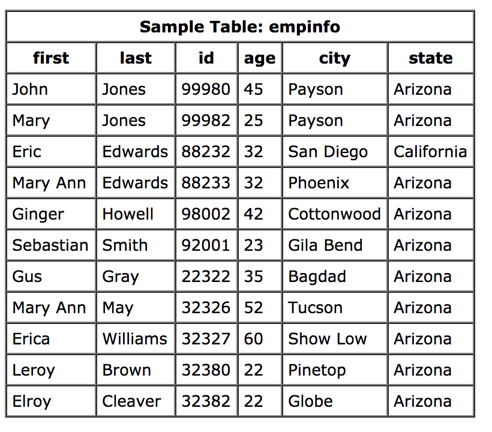

# Database & SQL

+++

### What is database

An Organized collection of data

**Analogy**

> It’s like your filing cabinet, not your junk drawer. The data is organized into folders, rather than just thrown in at random

+++

### How databases look like??

yeap, they are just a bunch of tables

+++

### Why we need database when developing Web App?

+++

### SQL??? What?

* Structured Query Language
* Used to communicate with database

---
# Schema

+++
### One-to-One

+++

### One-to-Many

+++

### Many-to-Many

---

# SQLite

